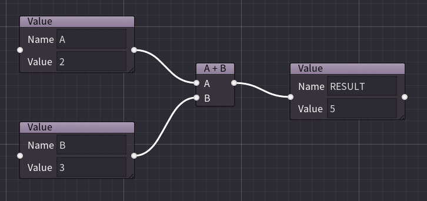
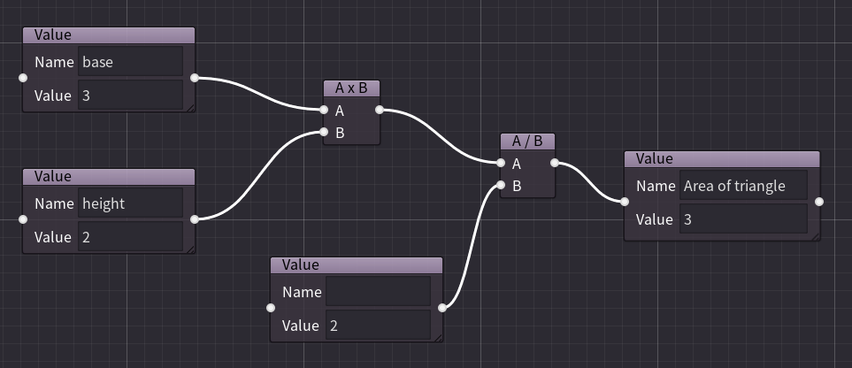
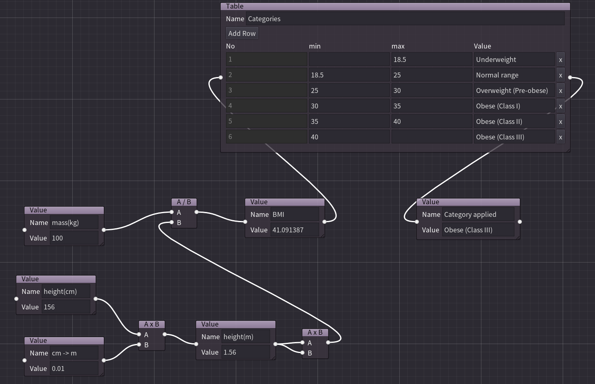

# Calc Node Editor (Beta)

## What is this ?

This app is an attempt to visualize number calculations with node graph.
The goal of the app is to visualize a complex number calculation like tax calculation.

## Trying the app

You can try the app on the web.

- [Calc Node Editor](https://hrk4649.github.io/calc_node_editor/godot3/index.html)
  - The app on the web uses a special file system that is not one your device uses. Using Export and Import instead of Save and Load may be better.

## Functions of the app

- Value node
  - Value node has a name and its value.
  - Value node is used as a constant if the value node has no any input edges.
- Basic operator node
  - addition (A + B)
  - subtraction (A - B)
  - multiply (A * B)
  - division (A / B)
    - Result of zero division will be null. 
- Summation and Product operator node
  - Summation (Σ)
  - Product (Π)
- Table node
  - Table node maps the input value into the categories with value.
- Option node
  - You can choose one of the options that converts to the specific value.
- Function node
  - Following functions are available: round(), floor(), ceil(), sin()

## Variations of the app

There are two variations of the app.
Development is mainly done on Godot 3.

Note: Godot 4's GraphEditor and GraphNode are planed to be changed in future release.

- Godot 3(3.5.2)
- Godot 4(4.1)

## Limitation

- Number of value calculations is limited to the number of node to prevent the app from infinite loop.

## Examples

Data files can be found in test_data directory.

### Addition of two numbers



```json
{"version":1,"nodes":[{"id":"4b7ec070-59e2-4c2a-945a-1c0443af604f","type":"value","name":"A","value":2,"input":[],"output":["36b8f107-ec90-418c-aab1-6275a1ec0631"],"ui_size":{"x":200,"y":102},"ui_position":{"x":20,"y":-20}},{"id":"abf0a903-342f-46a1-a9af-3147834bda75","type":"value","name":"B","value":3,"input":[],"output":["36b8f107-ec90-418c-aab1-6275a1ec0631"],"ui_size":{"x":200,"y":102},"ui_position":{"x":20,"y":160}},{"id":"36b8f107-ec90-418c-aab1-6275a1ec0631","type":"add","value":5,"input":["4b7ec070-59e2-4c2a-945a-1c0443af604f","abf0a903-342f-46a1-a9af-3147834bda75"],"output":["d355409b-b05e-48b2-88b8-0e9aea65edc3"],"ui_size":{"x":70,"y":79},"ui_position":{"x":320,"y":60}},{"id":"d355409b-b05e-48b2-88b8-0e9aea65edc3","type":"value","name":"RESULT","value":5,"input":["36b8f107-ec90-418c-aab1-6275a1ec0631"],"output":[],"ui_size":{"x":200,"y":102},"ui_position":{"x":480,"y":60}}]}
```

### Area of triangle



### BMI 

- https://en.wikipedia.org/wiki/Body_mass_index



### Withholding Tax (源泉徴収税)

- https://www.saisoncard.co.jp/credictionary/bussinesscard/article088.html (in Japanese)


## License

MIT License

## Copyright

(c) 2023 flat-e