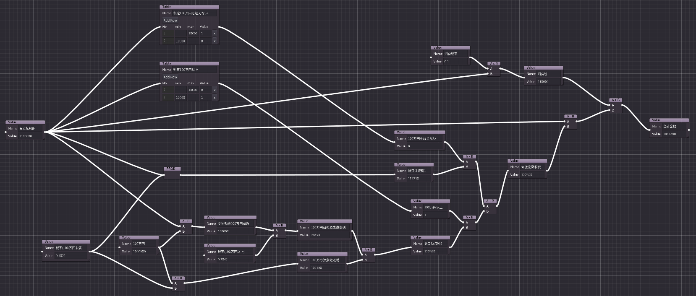

# Calc Node Editor (Beta)

## What is this ?

This app is an attempt to visualize number calculations with node graph.
The goal of the app is to visualize a complex number calculation like tax calculation.

## Trying the app

You can try the app on the web.

- <a href="https://hrk4649.github.io/calc_node_editor/godot3/index.html" target="_blank">Calc Node Editor</a>

## Functions of the app

- Value node
  - Value node has a name and its value.
  - Value node is used as a constant if the value node has no any input edges.
- Basic operator node
  - addition (A + B)
  - subtraction (A - B)
  - multiply (A * B)
  - division (A / B)
    - Result of zero division will be null. 
- Summation and Product operator node
  - Summation (Σ)
  - Product (Π)
- Table node
  - Table node maps the input value into the categories with value.
- Option node
  - You can choose one of the options that converts to the specific value.
- Function node
  - Following functions are available: round(), floor(), ceil(), sin()

## Variations of the app

There are two variations of the app.
Development is mainly done on Godot 3.

Note: Godot 4's GraphEditor and GraphNode are planed to change in feature.

- Godot 3(3.5.2)
- Godot 4(4.1)

## Limitation

- Number of value calculations is limited to the number of node to prevent the app from infinite loop.

## Examples

### addition of two numbers

### Area of triangle

### BMI 

- https://en.wikipedia.org/wiki/Body_mass_index

### Withholding Tax (源泉徴収税)

- https://www.saisoncard.co.jp/credictionary/bussinesscard/article088.html (in Japanese)

## License

MIT License

## Copyright

(c) 2023 flat-e